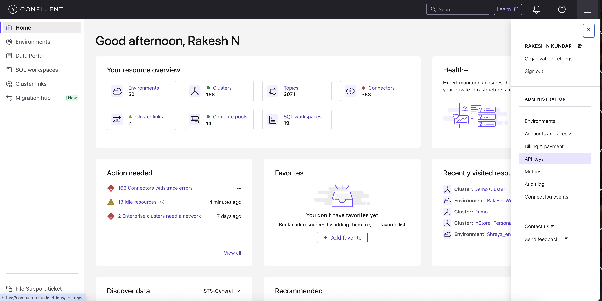
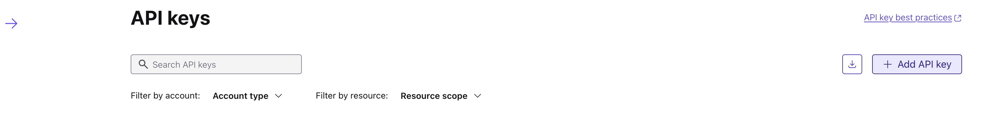
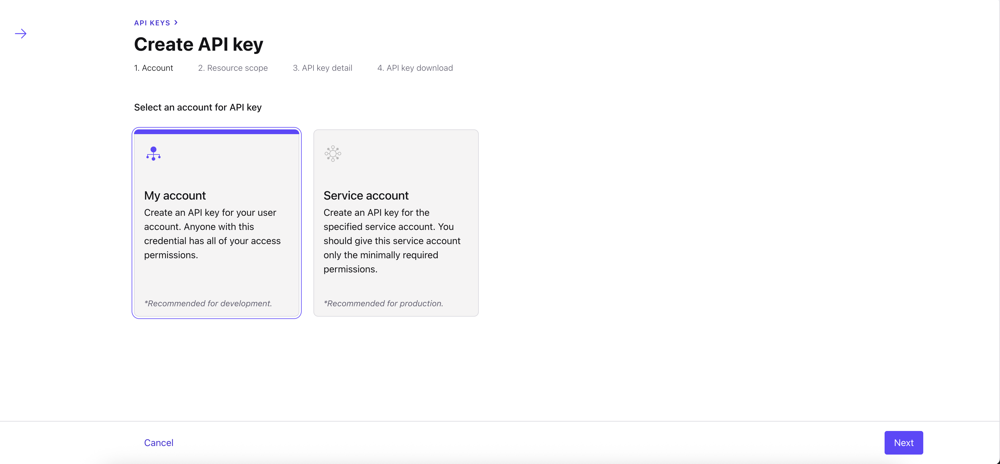
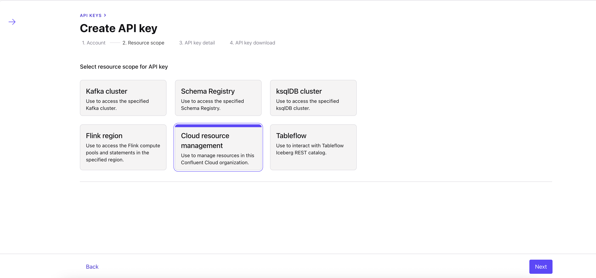
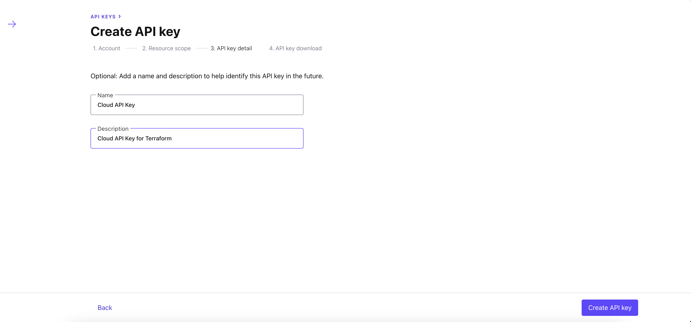

# 🚀 Java Table API Hands-on with Confluent Cloud for Apache Flink

This GitHub repository provides a step-by-step, hands-on guide to running Apache Flink Table API jobs using Java on fully managed Confluent Cloud for Apache Flink.

The workshop is designed for developers and data engineers who want to:

- Get started with Flink Table API

- Understand Confluent Cloud’s managed Flink offering

- Deploy and run Flink jobs using Java with minimal operational overhead

By the end of this guide, you’ll have a complete streaming pipeline running on Confluent Cloud—provisioned automatically using Terraform.

## 📌 What You’ll Learn

- How to provision Confluent Cloud infrastructure using Terraform
- How to use Apache Flink Table API (Java) for stream processing
- How to run Flink jobs on a fully managed Flink compute pool
- How to perform filtering, windowed aggregations, and stream joins


## ✅ Prerequisites

- [Confluent Cloud account](https://confluent.cloud)
- [Terraform](https://developer.hashicorp.com/terraform)
- [Maven](https://maven.apache.org/download.cgi)
- Java 11 or later

## 🏗️ High-Level Architecture

This repository automates and demonstrates the following workflow:

1. Terraform provisions Confluent Cloud resources
2. A Kafka cluster is created on GCP
3. A fully managed Flink compute pool is spun up
4. A Java-based Flink Table API job is deployed and executed
5. Streaming data is processed using filters, windowed aggregations, and joins


## Setup

Clone this github repository to your working directory. Set the working path to simplify the command executions.

```
git clone https://github.com/RakeshNKundar/TableAPI-Workshop-on-Confluent-Cloud-for-Apache-Flink.git

cd TableAPI-Workshop-on-Confluent-Cloud-for-Apache-Flink
```

## 🔐 Step 1: Generate a Confluent Cloud API Key

This project uses the **Confluent Terraform Provider**, which requires a special **Cloud API Key** to manage infrastructure.

### Steps to Create the API Key

- Login to your [Confluent Cloud account](https://confluent.cloud)


- Click on the **hamburger menu (☰)** on the top right of the sreen and select **API keys** menu



- Click on **ADD API Key** button 



- Select **My Account** option. **Note:** The user needs to have Organization Admin Role to create this API Key.



- Choose Cloud Resource management option



- Fill in Name and Description to your API key and then click on **Create** button. API Secret will be visible only once so you can download to your machine for later usage.




## 🧱 Step 2: Provision Confluent Cloud Infrastructure with Terraform

All the terraform scripts to provision Confluent Cloud resources are available under the **terraform** directory. Run the following commands to set up the infrastructure.

```
# Switch to terraform directory
cd terraform

# Initialize the terraform directory
terraform init

# Apply the terraform scripts
terraform apply --auto-approve
```

When prompted, enter:
- **CC_CLOUD_API_KEY**
- **CC_CLOUD_API_SECRET**

**NOTE** : It would take around 5 minutes for terraform to provision all resources on Confluent Cloud.

Once the terraform completes its execution, following resources are created automatically.
- Confluent Environment named `TableAPI_Workshop_{random_suffix}`
- Confluent Kafka Cluster named `Kafka_Cluster_{random_suffix}`
- Flink Compute Pool named `Flink_compute_pool_{random_suffix}`

**NOTE** : Save the terraform output which will be used while running Java TableAPI code

## ▶️ Step 3: Run the Java Flink Table API Job

The directory **flink-table-api-example** contains a Maven-based Java project that uses Flink Table API.

### Key Dependencies
- `flink-table-api-java` : Open source Flink's Table API package for defining the Flink Jobs
- `confluent-flink-table-api-java-plugin` : Confluent's Table API java plugin used to interact with Flink compute pool created on Confluent Cloud using REST endpoints.

### What the Flink Job Does
Using Confluent Cloud Flink's built-in sample `marketplace` mock data, the job:

1. Filters orders

    - Selects `ORDERS` events for a specific range of `customer_id`
    - Writes results to `orders_filtered` (Kafka-backed table)

2. Performs windowed aggregations

    - Calculates total sales per product
    - Uses a `1-MINUTE` **TUMBLE** window
    - Writes results to `orders_windowed_aggregation`

3. Enriches data via stream joins

    - Joins `ORDERS` with `PRODUCTS`
    - Produces `orders_product_enriched` table for downstream consumers

### Update the `ccloud.properties` file with necessary Confluent Cloud details

Fill in the details for the below config properties by grabbing it from the terraform output.
- client.organization-id
- client.environment-id
- client.compute-pool-id
- client.flink-api-key
- client.flink-api-secret : To obatin the flink api secret, search for `flink_api_secret` in the `terraform.tfstate` file in the terraform directory.

### Similarly, Update the `application.properties` file with necessary Confluent Cloud details
- environment-name
- kafka-cluster-name

This details can be found in the terraform output.

### Build and Run the Job
```
cd flink-table-api-example

# Build the JAR
mvn clean package

# Submit the Flink job
java -jar ./target/flink-table-api-java-examples-1.0.jar
```

The job will be submitted to the Confluent Cloud Flink compute pool using Confluent flink plugin through REST endpoint, and you can monitor its execution directly from the Confluent Cloud UI.

**Note**: It may take a 1 minute or 2 for the above command to run completely as Flink takes the job graph, allocates the necessary resources and once the Job is started, A response is returned to the Java client.


## 🧹 Teardown (Clean Up Resources)

To delete all provisioned resources, run:
```
cd terraform

terraform destroy --auto-approve
```
This ensures no unnecessary cloud resources continue running.
